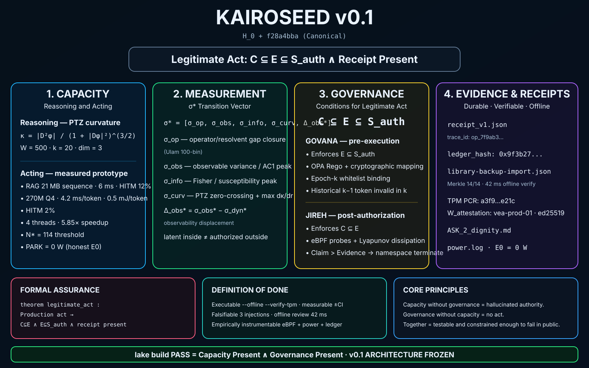

# KAIROSEED v0.1 — Canonical Architecture



**Canonical baseline:** `H_0 + f28a4bba`  
**Status:** Frozen architecture — v0.1

The diagram records the canonical v0.1 separation between capacity, measurement, governance, and durable evidence.

```text
Capacity ≠ Permission ≠ Evidence

Legitimate Act:
C ⊆ E ⊆ S_auth ∧ Receipt Present
```

The PTZ curvature estimator is:

```text
κ = |D²φ| / (1 + |Dφ|²)^(3/2)
```

This document is a reference artifact for the frozen architecture. Experimental measurements remain scoped to the recorded test environment and should not be read as universal performance guarantees.
